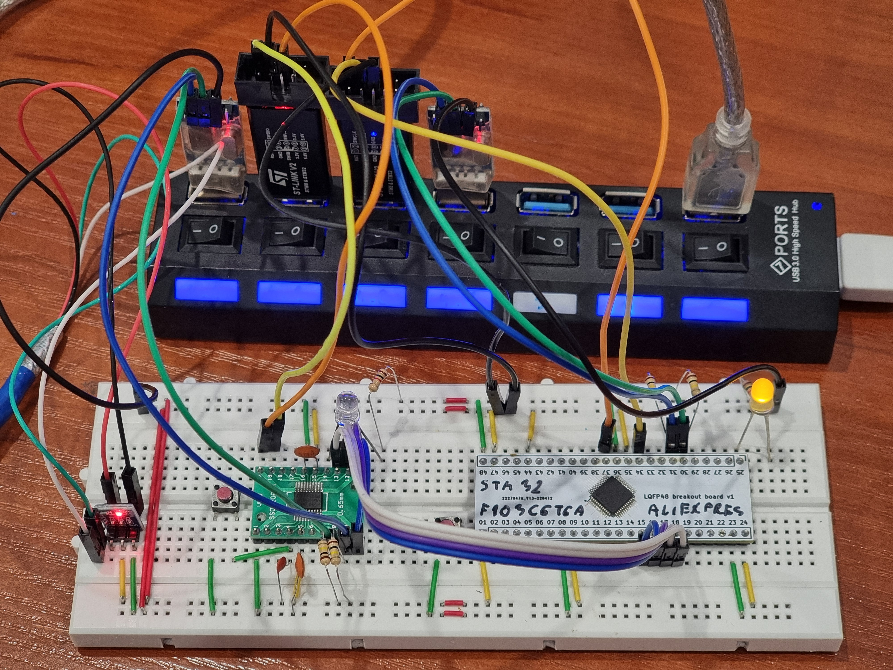

# Two programmers example

This repository is example for programing two different MCUs:

* **F103C6Tx** - big, white on the right.
* **F042F4Px** - tiny, green on the left.

Each of the have separated st-link and serial port. To connect to serial terminal simply run:

    make serial

and choose proper device to connect. It uses 115200 baudrate.

To program everything at once in main directory run:

    make flash

if MCU won't start, use resset button or run:

    make reset
